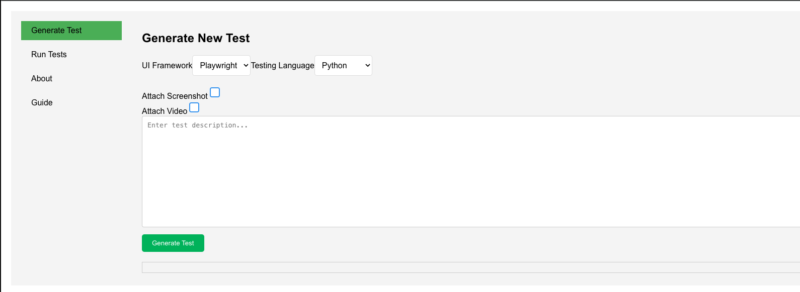
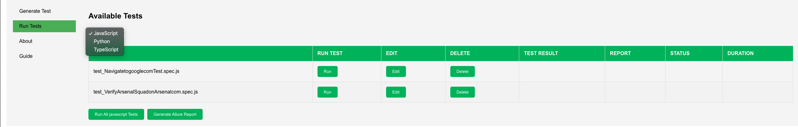

### Node.js Test Manager Web Application


Node.js AI Test Manager Web Application

### Overview
The Node.js Test Manager is a web application designed to simplify the process of generating, running, and managing automated tests. Built with a modern UI, the app leverages Node.js for the backend, while providing a sleek, user-friendly interface for seamless interaction. This application supports both Playwright and Selenium test frameworks and includes features for real-time test generation, execution, and detailed reporting.

## Getting Started
Clone the repository:

```bash
git clone https://github.com/dimag25/ai-tests-manager.git
cd ai-tests-manager
```
### Prerequisites

What things you need to install the software and how to install them:

- Node.js
- Python
- pip (Python package installer)
- Playwright/Jest/Selenium

### Installation

A step by step series of examples that tell you how to get a development environment running.

#### Step 1: Install Node.js Dependencies

To install the Node.js dependencies, navigate to the project directory in your terminal and run the following command:

```bash
npm install
```
This command installs all the dependencies listed in the package.json file.

#### Step 2: Install Pytest Dependencies
To install the Python/pytest dependencies, run the following command:
```bash
pip install pytest pytest-playwright allure-pytest
```

#### Step 3: Install Playwright Dependencies
To install Playwright, a Node.js library for browser automation, run the following command:
```bash
playwright install
npm init playwright@latest
```
This command installs the necessary dependencies and tools required for using Playwright.

### Usage
# Generate New Tests
- Navigate to the "Generate Test" tab.
- Enter the test description and choose the framework.
- Optionally, select the video and trace attachments.
- Click "Generate Test" to create the test script.
- Monitor the progress bar and wait for the report generation to complete.
# Run and Manage Tests
- Navigate to the "Run Tests" tab.
- View the list of available tests.
- Click the "Run" button to execute a test.
- Edit or delete tests using the respective buttons.

### Contributing
Contributions are welcome! Please fork the repository and submit pull requests for any features, improvements, or bug fixes.


### License
This project is licensed under the MIT License.


### Contact
For any questions or inquiries, please contact:
LinkedIn: [LinkedIn Profile](https://www.linkedin.com/in/dima-gurevich-7b184194/)
GitHub: [GitHub Profile](https://github.com/dimag25)
